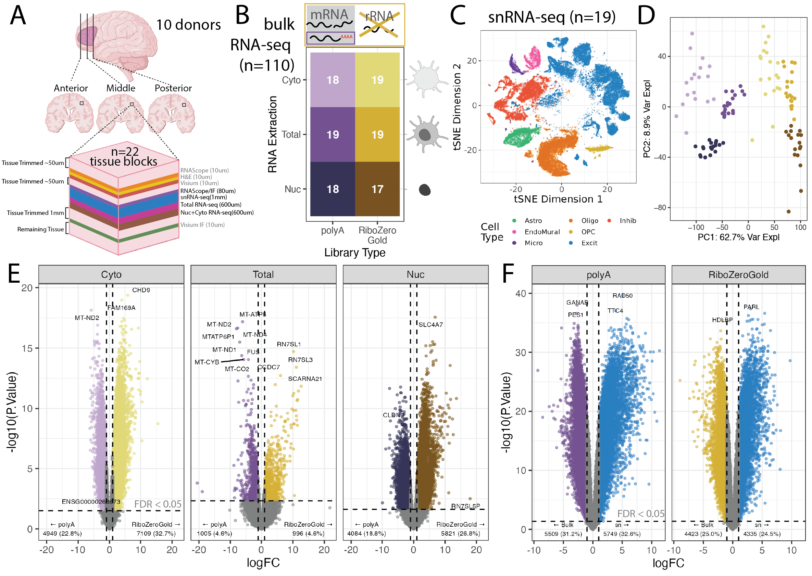

# Human_DLPFC_Deconvolution

## Study design
 
<p align="center">
  
</p>

**Experimental Design Overview and Exploration of Gene Detection in Different Assays**. **A**. Human postmortem brain dorsolateral prefrontal cortex (DLPFC) tissue blocks across the anterior to posterior axis from 10 donors were dissected for a total of 19 tissue blocks, these tissue blocks are a subset of the 30 tissue blocks that were used in a [previous spatial transcriptomic study](https://doi.org/10.1101/2023.02.15.528722). For each block, sequential slides were cut for different assays while maintaining the same white matter vs gray matter orientation. **B**. snRNA-seq data, generated as part of the same spatial transcriptomic study was collected for 19 tissue blocks ([Huuki et al., 2023](https://doi.org/10.1101/2023.02.15.528722)), from which bulk RNA-seq data was also generated across two library preparations (polyA in purple or RiboZeroGold in gold) and three different RNA extractions targeting different cell fractions: cytosolic (Cyto, light color), whole cell (Bulk, intermediate color), or nuclear (Nuc, dark color) in this study. **C**. Scatter plot of bulk RNA-seq principal components (PCs) 1 and 2. PC1 is associated with library type and PC2 with RNA extraction method. Colors are the same as groups in B. **D**. tSNE plot of the reference snRNA-seq data at the broad cell type resolution. **E**. Volcano plots for the differential expression analysis between polyA and RiboZero, faceted by RNA extraction method. The colors of the points are the same as B. **F**. Volcano plot for the differential expression analysis between total bulk RNA-seq (point colors same as _E_) and snRNA-seq (blue points).

## Citation

We hope that this repository will be useful for your research. Please use the following [BibTeX](https://en.wikipedia.org/wiki/BibTeX) information to cite this code repository as well as the data released by this project. Thank you!

> **Title (TODO)**

> Louise A. Huuki-Myers, Kelsey D. Montgomery, Sang Ho Kwon, Sophia Cinquemani, Sean K. Maden, Nicholas J. Eagles, Joel E. Kleinman, Thomas M. Hyde, Stephanie C. Hicks, Kristen R. Maynard, Leonardo Collado-Torres.

> bioRxiv (TODO DOI); doi: <https://doi.org/10.1101/TODO>

```
@article {TODO (once we have a pre-print)
}
```

## File locations

This is an integrative, multi-assay project including individual-matched data generated from human dorsolateral prefrontal cortex (DLPFC) using the RNAscope, 10X Chromium, and Illumina HiSeq platforms. Files are organized following the structure from [LieberInstitute/template_project](https://github.com/LieberInstitute/template_project). Scripts include the R session information with details about version numbers of the packages we used.

### 10X Chromium single-nucleus RNA-seq datasets

The snRNA-seq data is available as a `SingleCellExperiment` object. 

### Bulk RNA-seq datasets

The bulk RNA-seq datasets include 6 samples groups comprised of mRNA isolated from either nucleus, cytoplasm, or bulk, and from either polyA selection or RiboZero RNA-seq library types. Data come from 19 samples, meaning 113 total data points. 

These bulk RNA-seq data are available as a `SummarizedExperiment` object.

### RNAScope/HALO image datasets

Image data is generated for RNAscope slides by analysis with HALO and outputting the analysis results as `.csv` tables. These tables are read from the file tree located at the subdirectory [`raw-data/HALO/`](https://github.com/LieberInstitute/Human_DLPFC_Deconvolution/tree/main/raw-data/HALO).

Note that RNAScope experiments were performed with two combinations of markers, called `Circle` and `Star`, respectively, These experiments are distinct in that they each comprise of an analysis of an independent, albeit adjacent, tissue and each includes a different set of molecular markers (see table below).

## Variables and data dictionaries

The deconvolution project makes use of a number of metadata attributes and variables in the results files mentioned about. This section describes the key terms and definitions of these attributes and variables for the deconvolution method paper.

### Cell type labels

Cell type labels for `snRNA-seq` datasets are determined from the variable `cellType_broad_hc`. This can be accessed from the `sce` object in various ways such as `sce$cellType_broad_hc` or `sce[["cellType_broad_hc"]]`. Note that the deconvolution methods paper focuses on just 6 cell types of interest, and these are identified from among the cell type labels in the `cellType_broad_hc` variable.

Cell type labels for RNAScope experiments are obtained from the image analysis outputs produced by the HALO software. In brief, outputs each contain a series of columns corresponding to the cell type makers. Since each row in these outputs corresponds to an individual detected nucleus, we simply look at which marker is positive for that nucleus to determine its cell type. Cell type proportions and abundances are then calculated from these outputs.

Cell type labels aren't available for the bulk RNA-seq and other datasets produced for this project.

### RNAscope labels and marker types

The molecular markers for the `Circle` and `Star` RNAscope experiments are as follows:


0 | cellType | marker | Combo | Type | LongName
---  | ---  | --- | --- | --- | ---
1 | Endo | CLDN5 | Circle | Ab | Claudin_5 
2 | Astro | GFAP | Circle | Ab | GFAP
3 | Inhib | GAD1 | Circle | RNA_probe | GAD1
4 | Excit | SLC17A7 | Star | RNA_probe | SLC17A7
5 | Micro | TMEM119 | Star | Ab | TMEM119
6 | Oligo | OLIG2 | Star | Ab | OLIG2

## Terminology

Throughout the deconvolution project we try to use standard terms to refer to key project entities. Here are some of the
key terms to be aware of when using these project files and understanding analysis outputs.

### The deconvolution equation

We take deconvolution to be the prediction of cell type amounts in a mixed sample by leveraging data from a non-mixed sample. For the deconvolution method paper, we focus on predicting either cell abundances or proportions for each of 6 cell types in bulk RNA-seq data by leveraging a single-nucleus RNA-seq reference dataset. The deconvolution equation looks like:

$Y = \pi * Z$

Where $Y$ is a matrix of mixed signals having dimensions $[G,J]$, $\pi$ is a vector of cell type amounts (proportions or abundances), and $Z$ is a matrix of non-mixed signals having dimensions $[G,K]$. The dimensions of these objects include the $G$ marker gene set, $J$ samples with mixed signal, and $K$ cell types.

### Strict deconvolution

Strict deconvolution refers to solving for $\pi$ given a set of matrices $[Y,Z]$. In other words, if we assume we have a set of matrices $Y$ and $Z$, we then solve for $\pi$ based on these.

### Deconvolution preparation

This simply refers to steps taken to prepare $Y$ and $Z$ prior to performing deconvolution. This may include differential weighting of the marker genes, bias corrections, data transformations and rescaling, etc.

### Marker genes

The $G$ marker genes represent markers of cell types which we can use in deconvolution. Note, this is the "row" dimension in the $Y$ and $Z$ matrices.

### Samples

The $J$ samples are the samples having mixed signal, for which we predict cell type amounts. Note, this is the "column" dimension in the matrix $Y$.

### Cell types

The $K$ cell types represent the cell types for which we deconvolute signal and obtain amount estimates. Note, this is the "column" dimension in matrix $Y$ and the length of the vector represented by $\pi$.

## Funding sources

* NIMH (USA) [R01MH123183-01](https://reporter.nih.gov/search/yvBQf4z9EUWj-79epaE62g/project-details/10573242)
* LIBD

## Internal

JHPCE location: `/dcs04/lieber/lcolladotor/deconvolution_LIBD4030/Human_DLPFC_Deconvolution`

* snRNA-seq: The latest (final?) version is a file called `sce_DLPFC.Rdata` located at the subdirectory `DLPFC_snRNAseq/processed-data/sce/`.
* bulk RNA-seq: located at the subdirectory `Human_DLPFC_Deconvolution/processed-data/01_SPEAQeasy/`.
